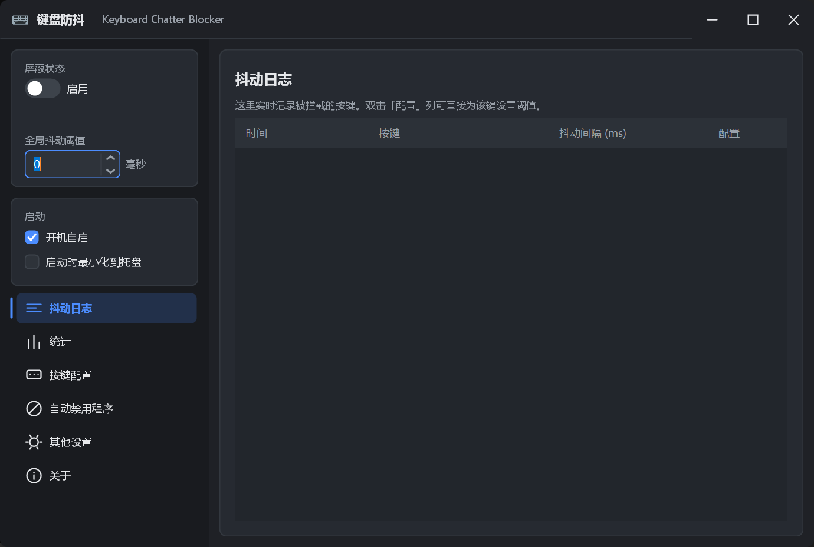
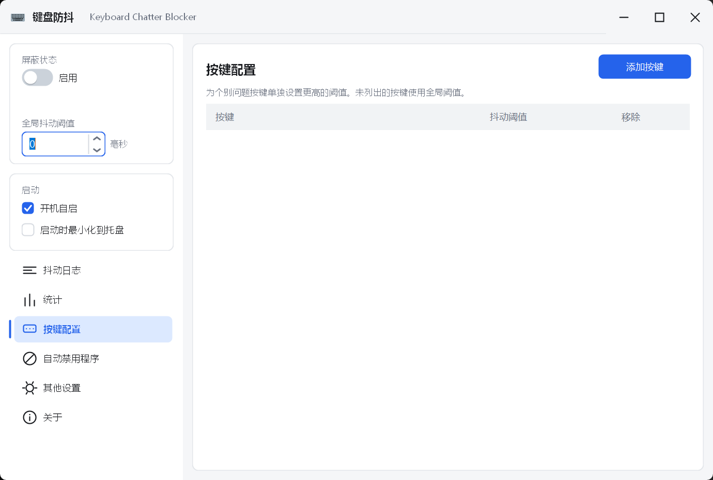

# 键盘防抖 (Keyboard Chatter Blocker · 现代化中文界面重写)

拦截机械键盘**连击（chatter）**的 Windows 工具 —— 按一次却触发多次的问题。
核心能力是**为每个问题按键单独配置阈值**，让坏键被压制的同时其余按键保持灵敏。

本仓库是 [FreneticLLC/KeyboardChatterBlocker](https://github.com/FreneticLLC/KeyboardChatterBlocker) 的界面重写版：
**现代化中文 UI，核心拦截逻辑与原版完全一致。**

## 界面预览

| 抖动日志（暗色） | 按键配置（亮色） |
|---|---|
|  |  |

全部 11 张截图（6 个页面 × 亮/暗）见 [`docs/screenshots/`](docs/screenshots/)。

---

## 相对原版改了什么

严格遵循「只动 UI」的约束，具体如下。

### 界面（全部重写）

| 原版 | 本版 |
|---|---|
| .NET Framework 4.7.2 | **.NET 10**（`net10.0-windows`） |
| TabControl + 7 个标签页 | **左侧导航栏 + 卡片式页面** |
| 系统默认控件外观 | **完全自绘**：圆角卡片、自定义标题栏、开关、下拉框、数值输入框 |
| 固定浅色 | **跟随系统亮/暗主题**，`Application.SetColorMode` 让原生滚动条与右键菜单同步 |
| 全英文 | **简体中文** |
| 480×407 窄窗 | 920×620，可缩放 |
| 无 DPI 适配 | **PerMonitorV2**，自绘几何与布局统一换算 |
| 无键盘测试 | **右侧常驻读数边栏**（可收起）+ **键盘测试页**：整张 104 键盘实时高亮 |

### 核心拦截逻辑

误判策略、判定的输入输出、状态表结构、配置文件格式全部保留。其中 **5 个文件与上游逐字节一致**：

```
AcceleratedKeyMap.cs  KeysHelper.cs  FullScreenDetectHelper.cs  KBCUtils.cs  KeyBlockedEventArgs.cs
```

另外 3 个文件有改动，全部列在下面「偏离」清单里：
`HotKeys.cs`（编译必需）、`KeyboardInterceptor.cs`（多传 2 个字段 + 新增 KeyEvent 事件）、
`KeyBlocker.cs`（新增「长按救援」，默认关闭）。

行为完全保留：全局低级键鼠钩子、逐键阈值、最小抖动时间、按下/抬起计时、排除注入事件、
鼠标键与滚轮抖动、临时屏蔽组合键、自动禁用程序列表、全屏自动禁用、其他键重置超时、
系统托盘、开机自启、统计、抖动日志、提示音。

### 十三处必须告知的偏离

1. **`Core/HotKeys.cs` 删除了 2 行**（`using System.Security.Permissions;` 与
   `[PermissionSet(SecurityAction.LinkDemand, Name = "FullTrust")]`）。
   原因：`PermissionSetAttribute` 不在 net10.0 引用程序集中，保留会编译失败。
   CAS（代码访问安全）在 .NET Core+ 已彻底移除，声明式安全特性**运行时本就被完全忽略**，
   删除属零行为变更。这是唯一被改动的一行核心代码。

2. **开机自启的实现方式改变**，可观察行为不变。
   原版引用 `IWshRuntimeLibrary` COM 程序集（.NET Framework 专属），
   本版改用迟绑定的 `WScript.Shell`。产出的快捷方式路径、目标、工作目录**完全一致**：
   `%APPDATA%\Microsoft\Windows\Start Menu\Programs\Startup\KeyboardChatterBlocker.lnk`，
   勾选状态不再只看 `File.Exists(...)`，而是**读出 .lnk 的 `TargetPath` 跟当前 exe 比对**。
   原版那样只看存在与否会撒谎：`KeyboardChatterBlocker.lnk` 这个名字谁都能占 ——
   别的软件、或本程序的另一份拷贝写了这个快捷方式，界面照样打勾，
   但开机启动的根本不是你现在用的这一份。
   指向别处时本版**不勾**，勾选框里改画一枚方块，悬停会显示实际指向的路径；
   点一下会把快捷方式改成指向当前这一份。
   唯一差异在**错误路径**：原版创建失败会抛出未捕获异常直接崩溃，本版改为弹中文提示框并回滚勾选状态。

3. **两处下拉框的判定逻辑改为按索引**，枚举值与配置序列化格式不受影响。
   - `MeasureFromComboBox`：原版靠 `Enum.TryParse(下拉框文本)`，中文文案会让解析静默失效 → 改为按 `SelectedIndex`。
   - `NeedInputForm` 的特殊按键下拉：原版 `switch (文本)` → 改为按 `SelectedIndex`。

4. **统计页刷新间隔 1000ms → 150ms**，纯粹是手感调整。
   原版按下按键后数字要等一秒才跳。`Program.Blocker.AnyKeyChange` 为 false 时整个 tick 只是
   两次布尔判断，空转开销可忽略，实际重建表格的频率仍受「有按键发生」约束。

   ⚠️ 注意：原版用**定时器 tick 次数**计满 30 分钟再自动保存统计（1800 次 × 1 秒）。
   若只把间隔调快，自动保存会变成 4.5 分钟一次 —— 那是行为变更。因此保存计时已改为按真实时间
   每秒记一次，**30 分钟的保存节奏与原版一致**。改 `StatsRefreshIntervalMs` 这个常量不会影响它。

5. **表格排序**，纯展示层，不涉及数据与配置。
   原版每次刷新都 `Rows.Clear()` + `Rows.Add()` 全量重建表格，用户按列头选的排序会丢 ——
   DataGridView 的排序状态记在列头的 `SortGlyphDirection` 上，`Rows.Clear()` 不会清掉它，
   但新加入的行也不会自动按它排列。
   本版新增 `ModernDataGridView.ReapplySort()`：重建或追加行之后，按列头当前的排序方向重排。
   统计页与按键配置页的刷新、抖动日志的追加都会调用（未点过列头时零开销，直接返回）。
   另外给 4 个数值列声明了 `ValueType = int`，按数值而非字符串比较
   —— 否则「按下次数」会排成 `100, 30, 50, 80`。

   **未点列头时不施加任何排序**，行序与原版一致（`Dictionary` 的遍历顺序）。

6. **新增「长按救援」，默认关闭** —— 这是唯一一处改动到拦截逻辑本身的功能。
   - 动机：一次按下被拦下时钩子返回 `1`，这个 down **根本不会进入系统**。
     后果远不止少一次按键 —— 系统不认为该键被按下，就不会产生键盘自动重复，
     消息驱动的游戏在整个长按期间都收不到它，要等约 500ms 的系统重复才可能恢复。
   - 做法：被拦下时挂一个待救援标记；若该键持续按住超过「长按救援阈值」，
     说明它其实是一次长按、而非抖动的短促连击，此时补发一次等价的 keydown 把它救回来。
   - 补发用**扫描码 + 扩展位**（都取自真实的那个事件）而不是虚拟键码 ——
     DirectInput / Raw Input 类游戏读的是扫描码，只带 `vkCode` 的合成事件会被忽略。
   - 阈值在「其他设置」页可调（`0` = 关闭）。对应配置项 `hold_rescue_time`；
     上游程序读到这一行会直接忽略，因此 `config.txt` 仍可双向通用。
   - 涉及文件：新增 `Core/KeySynth.cs`（合成输入），`KeyBlocker.cs` 与
     `KeyboardInterceptor.cs` 相应改动。
   - **风险**：这属于合成输入。部分游戏（尤其带反作弊的）会丢弃合成事件；
     它也是本项目里唯一会主动往输入流写数据的地方，所以默认关闭。

7. **新增「仅在该程序位于前台时禁用」开关，默认开启** —— 自动禁用程序列表的判定方式。
   - 上游行为：只要列表里的进程**在运行**就暂停屏蔽，不管它是不是当前窗口。
     把游戏最小化挂到后台去用浏览器，屏蔽会一直停着。
   - 本版默认只在**该程序位于前台窗口**时才暂停屏蔽；切到别的窗口立刻恢复。
   - 「自动禁用程序」页可关掉这个开关，回到上游行为。
   - 对应配置项 `auto_disable_foreground_only`（上游读到会忽略）。
   - 顺带的好处：「仅前台」模式下直接查询前台窗口所属进程即可，
     不再需要每 2 秒枚举一次全部进程。

8. **新增键盘实时读数侧边栏 + 「键盘测试」页** —— 纯新增功能，不改变任何既有判定。
   - **右侧常驻边栏**：最近按下的键、与上一次按键的间隔、与上一次**同键**按下的间隔、
     该次按下是否被放行、当前按住的键。标题栏左侧的按钮可收起/展开。
   - **键盘测试页**：整张 ANSI 104 键盘（主键区 + 导航区 + 小键盘）实时高亮 ——
     蓝色 = 已按下且放行，红色 = 已按下但被屏蔽吞掉（这正是最该被看见的状态）。
     被拦过的键**松手后仍留一圈红框**，测完一轮一眼就能看出哪些键有问题。
   - **测试页顶部的汇总统计**（该页自己的计数，与「统计」页的持久统计是两回事）：

     | 指标 | 含义 |
     |---|---|
     | 状态 | 整轮测试的结论：无抖动显示绿色「✅ 未检测到抖动」，否则红色告警 |
     | 总按键数 | 本轮实际按下的次数（**同一键按住时的系统自动重复不计**） |
     | 抖动事件 | 其中被屏蔽拦下的次数 |
     | 平均间隔 | 同一按键连续两次按下之间的平均间隔 |
     | 最小间隔 | 上述间隔的最小值 —— 最能反映键盘抖动程度的数字 |
     | 全局抖动阈值 | 当前的全局阈值，用来和最小间隔对照 |

   - 只有「同一按键连续两次按下」才计入间隔，`A→B→A` 里的两次 A 之间夹了 B，不计；
     键盘自动重复（按住不放）也不算新的按下。
   - **间隔超过 1 秒的直接丢弃，不进样本**。抖动是毫秒级的；隔了一秒以上再按是
     「又按了一下」，跟抖动无关，收进样本只会把平均间隔拉成没有意义的数字 ——
     按几下停一会儿，平均值就被稀释到看不出问题了。
   - 右上角「重置」按钮清空红框标记、高亮状态与全部统计，可随时重新测一轮。
     它**只能用鼠标点** —— 这一页的每一次按键都是测试数据，不能让按钮把空格/回车吃掉。
     （`ModernButton.Focusable = false`：关掉 `Selectable`、拿到焦点立刻让出、并吞掉空格与回车。
     单关 `Selectable` 不够 —— `ButtonBase` 在鼠标按下时会绕过它直接 `Focus()`。）
   - 两者都**不受「启用」开关影响** —— 屏蔽关掉时同样可用（`AllowKeyDown` 会直接放行，
     但事件照常上报）。
   - `KeyboardInterceptor.cs` 为此新增 `KeyEvent` 事件，在上报时刻带出判定结果。
   - 该回调处在输入路径上，因此只做数值记录与设置控件文本（设置 Text 只标脏、
     不会同步重绘），重绘交给下一帧。

9. **「关闭时隐藏到托盘」拆成独立开关，默认开启。**
   上游用 `hide_in_system_tray` 一个开关同时管「启动时隐藏」和「关闭时隐藏」，
   而那个名字只提了启动 —— 很难看出点关闭也会躲进托盘。
   本版拆开：启动仍由 `hide_in_system_tray` 管，关闭由新增的 `close_to_tray` 管。
   托盘图标被 `disable_tray_icon` 关掉时，关闭会照常退出（否则窗口既不在任务栏、
   也没有托盘图标，将无处可寻）。

10. **纯展示的地方一律不接键盘** —— 这是个键盘工具，敲键盘时不该把界面点着。
    「抖动日志」「统计」两页的表格、「键盘测试」页的「重置」按钮都设成不可获焦点：
    方向键不改选中、打字不触发「首字母跳行」、空格/回车不触发按钮单元格，
    焦点也不会在鼠标点过之后留在它们身上。鼠标点选、双击、滚轮全部照常。
    「按键配置」页要用 Delete 删键，所以保持可获焦点。

    > 实现上有个坑：单关 `ControlStyles.Selectable` 是不够的 —— `CanSelect` 确实会变成
    > `false`、Tab 也跳不过去，但 `ButtonBase` 在鼠标按下时会**绕过** `Selectable`
    > 直接调 `Focus()`，所以按钮照样能拿到焦点。要三件事一起做：关 `Selectable`、
    > 拿到焦点立刻让给下一个控件、再吞掉空格与回车。

11. **让钩子始终待在钩子链最前面** —— 修复「先开本程序、后开游戏 → 拦不住」。纯 UI 层改动，
    `Core/` 一字未动。

    Windows 的钩子链是**后装的先被调用**，而且**任何一个钩子返回非 0 就截断整条链**。
    有些游戏自己就装了低级键盘钩子（A Dance of Fire and Ice 实测有三个组件这么做：
    `Assembly-CSharp-firstpass.dll` 里的 `SetWindowsHookEx` + `WH_KEYBOARD_LL`、
    `Rewired_Windows.dll`、`SkyHook.Unity.dll`）。游戏若在本程序**之后**启动，
    它的钩子就排在本程序前面 —— 一旦它吞掉按键不往下传，本程序根本收不到按键，
    也就无从拦截。

    现象很有辨识度：**先把游戏开好再开本程序（或中途重启一次本程序）就正常，
    反过来就不行**。

    对策：`SetWindowsHookEx` 永远把新钩子插到链首，所以**重装一次**就能抢回最前面。
    `UI/HookKeeper.cs` 在前台窗口切换时重装（游戏切到前台那一刻正是要抢的时候），
    600ms 后再补一次（有的游戏是拿到前台之后才装自己的钩子），另有 5 秒兜底。

    > 副作用：本程序会始终占据链首，其他键盘工具（如 PowerToys Keyboard Manager）
    > 排在它之后收到按键。平时本程序原样往下传，所以它们照常工作；
    > 只有判定为抖动并吞掉的那一次，它们才看不到。

    > 验证方式值得一提：在测试进程里再装一个「恶意」钩子（吞掉按键且不调
    > `CallNextHookEx`）来模拟抢先的游戏 —— 它装得晚所以排在链首，
    > 此时本程序读自己的拦截计数，确认**完全收不到按键**；调用重装后，
    > 计数恢复增长。一个实验同时证明了病因和药效。

12. **新增「键盘设备」白名单** —— 只在指定的键盘上拦截抖动，默认所有键盘。
    多键盘场景：一把键盘的某个键坏了，只想拦它，不想连带影响另一把。

    **默认行为完全不变**：不配置时所有键盘都参与拦截，配置里也不会多出这个键。

    界面上是一个设备列表（只列**按出过按键**的键盘，虚拟设备本来就不发按键，列出来只会碍事），
    显示的是**系统给的可读名**（`HID Keyboard Device` / `Standard PS/2 Keyboard`），
    从 `HKLM\SYSTEM\CurrentControlSet\Enum` 里按设备实例 ID 读出来 ——
    Raw Input 的设备路径能机械地推出这个 ID，不必用 SetupAPI。

    > 可读名有个坑：**好几把键盘会共用同一个名字**（实测这台机器上三个设备都叫
    > `HID Keyboard Device`）。所以重名的一律补上 VID:PID 消歧，
    > 变成 `HID Keyboard Device (1A2C:7FFF)` 这种。

    另外配一个「识别」按钮：点一下再按某个键盘，对应那行会高亮 ——
    名字再可读，也没法保证你一定分得清哪把是哪把。

    > **为什么设备识别跑在独立进程里。** 低级钩子拿到的 `KBDLLHOOKSTRUCT` 没有设备标识，
    > 唯一能区分键盘的途径是 Raw Input 的 `WM_INPUT`（它带 `hDevice`）。
    > 但实测（可复现）发现：**在进程内一调用 `RegisterRawInputDevices`，
    > 本进程的低级键盘钩子就彻底停止被调用** —— 句柄正常、重装钩子无效、
    > 换独立线程也无效，而注销注册后立刻恢复。对靠钩子吃饭的本程序来说这是致命的。
    > 所以 `UI/DeviceTrackerHost.cs` 用**同一份 exe 加 `--device-tracker` 开关**
    > 起第二个实例，它不建窗体、不装钩子，只把「最近一次按键来自哪把键盘」
    > 写进共享内存；主进程定时读（`UI/KeyboardDevices.cs`）。
    >
    > 副作用：任务管理器里会多一个同名的无窗口进程。它跟着主进程走 ——
    > 主进程一退它就退。

    > **一个绕不过去的取舍**：钩子回调永远早于 Raw Input（实测早 0.6~14ms，因为
    > Raw Input 要等钩子返回才投递），所以判断当前按键用的是「上一个按键的设备」——
    > **滞后一次事件**。一直用同一把键盘时完全正确；跨键盘切换后的第一次按键
    > 可能落到上一把上，之后立刻纠正。想等 Raw Input 到货会死锁，无解。

13. **逐键盘阈值 + 四个页面按键盘筛选** —— 同一个键在不同键盘上可以有不同阈值，
    抖动日志 / 统计 / 按键配置 / 键盘测试四页右上角各有一个键盘筛选框。

    **默认行为一字不变**：不配置任何逐键盘项时，查找会一路退到全局值，与以前完全一致。

    **查找顺序**（逐层退让）：

    ```
    本键盘的覆盖  key.<短id>.<键名>
      ↓ 没有
    全局逐键      key.<键名>          ← 上游既有写法
      ↓ 没有
    全局默认      global_chatter
    ```

    配置里的**短 id** 由程序从设备路径生成（`vid_1a2c&pid_7fff` → `1a2c-7fff`；
    取不到 VID/PID 的走 ACPI 内置键盘则用路径前两段 → `acpi-msft0001`）：

    ```ini
    key.H: 100              # 全局逐键（上游写法，不变）
    key.1a2c-7fff.H: 60     # 只在这把键盘上生效
    ```

    **四个页面的筛选各是什么含义**：

    | 页面 | 选了某把键盘之后 |
    |---|---|
    | 抖动日志 | 只显示这把键盘拦下的记录（新增了一列「键盘」） |
    | 统计 | 次数/抖动/抖动率都只统计这把键盘 |
    | 按键配置 | 显示并编辑**这把键盘专属**的阈值；选「全部键盘」则是全局那份 |
    | 键盘测试 | 键盘图与测试统计只响应这把键盘 |

    **统计的持久化是加法式扩展**，`blocker_stats.csv` 的老行一字未动：

    ```
    H,100,5,                  ← 全局合计，上游照读
    dev:1a2c-7fff,H,80,5,     ← 新增的设备维度明细
    ```

    上游的读取代码会对 `dev:` 开头的行 `Enum.TryParse` 失败然后静默跳过
    （这是它既有的容错行为），所以那份文件两边都能读。已实测：拿这份文件走一遍
    上游的解析逻辑，能解析的行数仍是老行那些，全局数据不受影响。

    > 四个筛选框与「键盘设备」页的「识别」按钮**都不可获焦点**（关 `Selectable` +
    > 拿到焦点立刻让出，与「重置」同一套办法）—— 这是键盘工具，空格/回车得留给下面的东西。
    > 鼠标点开下拉照常，已实测。
    >
    > **三个已知限制**：
    > ① 设备归属**滞后一次事件**（见第 12 条），逐键盘阈值与统计都继承这一点；
    > ② 两把**同型号**键盘的 VID/PID 相同，短 id 会撞车；
    > ③ **鼠标键没有键盘归属**（`mouse_left` 等），永远走全局档。

---

## 下载与运行

发布产物是**单个 exe**（约 480 KB）：

```
bin/Release/net10.0-windows/win-x64/publish/KeyboardChatterBlocker.exe
```

需要目标机器已安装 **.NET 10 桌面运行时**。若不想依赖运行时，可改为自包含发布：

```bash
dotnet publish -c Release -r win-x64 -p:SelfContained=true -p:PublishSingleFile=true
# 约 70–150 MB，目标机器无需安装任何东西
```

## 从源码构建

```bash
dotnet build  -c Debug
dotnet publish -c Release     # 单文件输出到 publish/
```

## 配置文件

配置文件名、路径与格式**与原版完全一致**，可直接沿用旧配置。

- 放在 exe 同目录的 `config.txt`
- 若 exe 位于 `Program Files` 下，则改存 `%localappdata%\KeyboardChatterBlocker\config.txt`
- 统计文件 `blocker_stats.csv` 格式不变

```ini
is_enabled: false
global_chatter: 100
hide_in_system_tray: false
measure_from: Press
minimum_chatter_time: 0

key.H: 120
key.E: 60
key.mouse_left: 80

auto_disable_programs: notepad/calc
auto_disable_on_fullscreen: false
other_key_resets_timeout: false
exclude_injected: false
auto_disable_foreground_only: true
close_to_tray: true

hold_rescue_time: 150

hotkey_toggle: ctrl + alt + shift + F9
```

> `hold_rescue_time` 是本版新增项。上游程序读到会忽略，所以同一份 config.txt 两边都能用。

---

## 调试按键的推荐流程

1. 把「全局抖动阈值」设为 `0`（本版默认即 0，等价于不拦截任何按键）
2. 到「按键配置」页把你怀疑有问题的键加进来，阈值先设成 `300` 毫秒
3. 正常打字，去「抖动日志」页观察实际记录到的「抖动间隔」
4. 按观察到的最大值往下调，调到你打字不再被误拦为止
5. 最后再设置一个全局阈值，覆盖其余按键

> ⚠️ 程序装的是**全局键盘钩子**，启用后会拦截所有按键（包括你用来改配置的按键）。
> 调试时建议保持「全局阈值 0 + 未启用」，或在虚拟机 / 独立用户下测试。

## 已知限制

- **仅 Windows**。依赖 `WH_KEYBOARD_LL` / `WH_MOUSE_LL`，登录界面等受保护区域不覆盖。
- 部分反作弊系统可能将其判定为可疑程序（上游 README 提到过 VAC 误封案例）。
- 与部分越南语输入法（EVKey、Unikey）存在冲突，它们会发送特殊键码。
- 高 DPI 缩放在**程序启动时**确定；运行中把窗口拖到不同缩放的显示器不会重新排版。
- **装在内核态读 HID 的反作弊系统拦不住**（输入不经过用户态钩子链）。见上文第 11 条 ——
  用户态范围内能做到的都做了（含 Raw Input，已实测）。
- 本程序会占据键盘钩子链首位，其他键盘工具（PowerToys 等）排在它之后。平时原样往下传，
  只有判定为抖动才吞，所以一般无感（见第 11 条）。
- **键盘设备白名单会多起一个同名进程**（无窗口，`--device-tracker`），
  跟着主进程生灭。跨键盘切换后的第一次按键可能被判到上一把上（见第 12 条）。

---

## 项目结构

```
KeyboardChatterBlocker/
├─ KeyboardChatterBlocker.csproj    SDK 风格工程（net10.0-windows）
├─ app.manifest                     仅声明 Win10/11 兼容性
├─ Program.cs                       入口（Initialize 顺序有讲究，见注释）
├─ Core/
│   ├─ AcceleratedKeyMap.cs  等 5 个  ⊘ 与上游逐字节一致
│   ├─ HotKeys.cs                   仅删 2 行（见偏离 1）
│   ├─ KeyboardInterceptor.cs       多传扫描码/扩展位（见偏离 6）
│   ├─ KeyBlocker.cs                新增长按救援（见偏离 6）
│   └─ KeySynth.cs                  新增：合成输入
├─ Assets/keyboard.ico              应用图标 + 托盘图标
└─ UI/
    ├─ MainBlockerForm.cs           事件处理层（与原版逐条对齐）
    ├─ MainBlockerForm.Designer.cs  纯代码布局
    ├─ NeedInputForm.cs             按键捕获对话框
    ├─ KeyConfigurationForm.cs      单键阈值编辑对话框
    ├─ AppIcons.cs
    ├─ Theme/                       Palette / ThemeManager / Metrics / Fonts / Drawing / NativeMethods
    ├─ Controls/                    自绘控件库
    └─ Localization/                Strings（文案） / KeyNames（键名中文化 + 反查）
```

### 两条实现约定

**1. 自绘控件一律继承对应原生控件，只重写 `OnPaint`。**
例如 `ToggleSwitch : CheckBox`、`ModernDataGridView : DataGridView`。
这样 `MainBlockerForm.cs` 里 90% 的事件处理逻辑可以原样保留，只改 `TabControl` 相关的 3 处引用。

**2. DPI 缩放由 `Metrics.Px()` 统一换算，关闭框架自动缩放。**
PerMonitorV2 下 WinForms 会把 `AutoScaleDimensions` 改写成当前 DPI，导致缩放因子恒为 1 ——
控件不缩放而文字按高 DPI 渲染，文字会撑破布局。因此显式设 `AutoScaleMode.None`，
所有布局尺寸经 `Metrics.Px()`、所有画笔宽度经 `Metrics.Pxf()` 换算。

> 另有一个 GDI+ 坑：`Graphics.SmoothingMode = AntiAlias` 必须在背景 `FillRectangle` **之后**设置，
> 否则整块填充会偏移半像素，在控件边缘留下一条半透明接缝。所有自绘控件的 `OnPaint` 都按此顺序书写。

---

## 验证结果

| 项 | 结果 |
|---|---|
| `Core/` 逐字节比对 | 5 个文件与上游完全一致；`HotKeys.cs` / `KeyboardInterceptor.cs` / `KeyBlocker.cs` 有上文列明的改动 |
| 长按救援 | 被拦后按住 400ms 救回 1 次；仅按 60ms 不触发（不会凭空造出按键）；阈值为 0 时不触发 |
| 仅前台自动禁用 | 列表程序在后台运行时不暂停屏蔽；当前台进程命中列表时暂停；开关关闭后恢复上游行为；目标退出后恢复屏蔽 |
| 键盘测试页 | 注入按键后键盘图正确高亮（放行=蓝、被拦=红），间隔读数与判定徽标同步更新 |
| 红框标记 | 拦下 A 和 D 并松开后，两键仍带红框、标记数=2；点「重置」后标记与统计一并归零 |
| 「重置」不吃按键 | 鼠标点「重置」仍照常清空标记，但焦点不会落在按钮上（`CanSelect=False`、`Focus()` 返回 false）；随后按空格/回车，标记数不变，空格照常被记进「总按键数」 |
| 测试页统计 | 注入 `A`(间隔 305ms) → `A`(间隔 55ms，应被拦) → `D` 共 4 次按下：总按键数=4、抖动事件=1、最小间隔=94ms（落在 100ms 阈值内）、平均间隔=218ms，状态行转为红色告警；按住不放的自动重复未计入按下次 |
| 间隔 1 秒上限 | 按 `A` → 停 1.5 秒 → 再按 `A`：总按键数=2，平均间隔显示「—」（长间隔未进样本）；再隔约 450ms 按一次，平均间隔=453ms（短间隔正常计入） |
| 表格屏蔽键盘 | 「抖动日志」「统计」两页：`Focusable=False`、`CanSelect=False`、`Focus()` 返回 false；真实鼠标点击后焦点不在表格上；`WM_MOUSEWHEEL` 仍能滚动（首行 0 → 9） |
| 开机自启的归属判定 | 启动项指向 `D:\KeyboardChatterBlocker.exe`、而程序跑在别处时：不勾 + 方块标记；自建 .lnk 指向本 exe → 判为自己，指向记事本 → 不是自己，文件不存在 → 读出 null |
| 钩子链被截断 | 测试进程内再装一个「恶意」钩子（吞掉按键且不调 `CallNextHookEx`）后，快速连按 4 次测试键 → 本程序拦截计数 **0 → 0**（完全收不到）；调用重装后 → **0 → 2**（恢复拦截） |
| 进程内注册 Raw Input 的后果 | 同一进程里注册前后对比：注册前钩子被调用且拦得住（`KeyEvent +8 拦截 +2`）；注册后 `KeyEvent +0 拦截 +0`（钩子彻底哑掉）；注销注册后立刻恢复。换独立线程也一样，故为进程级 |
| 独立进程做设备识别 | 主进程钩子在窗体正常/最小化/恢复前台三种状态下均 `KeyEvent +8 拦截 +2~3`（钩子健康）；辅助进程 1 个、无窗口、父进程为主进程；两把键盘被识别成两个不同设备（`vid_1a2c&pid_7fff` / `acpi msft0001`） |
| 白名单过滤 | 白名单为空（默认）→ 拦截 +3；白名单填一个不存在的设备 → 拦截 +0；再清空 → 拦截 +3 |
| 设备可读名 | 外接键盘 → `HID Keyboard Device`，笔记本内置 → `Standard PS/2 Keyboard`；伪造路径 → 退回机器码兜底。同一名字的两台设备消歧后 → `HID Keyboard Device (1A2C:7FFF)` / `HID Keyboard Device (30FA:1701)` |
| 逐键盘阈值分层 | 全局 `key.F24: 200` + 本键盘 `key.1a2c-7fff.F24: 60`：同一段 120ms 连按 —— 在配了 60 的键盘上放行、设备未知时拦下（回落全局 200）、在别的键盘上也拦下。经反射读出实际生效阈值分别是 60 / 200 / 200 |
| 逐键盘配置往返 | 写出 `key.F24: 200` 与 `key.1a2c-7fff.F24: 60` 两行；新起一个 KeyBlocker 读回，两者都还原 |
| 统计 CSV 兼容 | 文件里同时有 `F24,10,3,` 与 `dev:1a2c-7fff,F24,7,2,`；按上游的读法（`Enum.TryParse` 失败即跳过）只解析出 1 行全局行；只留老格式行时全局数据仍能读回 |
| 四页筛选框与日志新列 | 四页筛选框均在卡片右上角、距右边 24px；键盘测试页那个 `CanSelect=False`（不抢焦点）；抖动日志列为 时间/键盘/按键/抖动间隔/配置 |
| 真实游戏（A Dance of Fire and Ice） | 「先开本程序、后开游戏」这个原本失败的顺序，改用带抢链首的构建后抖动消失（用户实测） |
| 右侧读数边栏 | 读数随按键实时更新；收起后内容区自动填满，标题栏开关的颜色跟随状态变化（展开=强调色、收起=灰） |
| 关闭到托盘 | 走真实 ✕ 路径（`Form.Close()`）时 `CloseReason=UserClosing, Cancel=True`，窗口隐藏且托盘图标出现；`close_to_tray: false` 时正常退出；与 `hide_in_system_tray` 互相独立 |
| 输入焦点 | 启动后及每次换页都会把焦点从侧边栏阈值框让开 —— 否则在这个键盘工具里随便敲什么都会跑进阈值框 |
| 合成输入可用性 | `INPUT` 结构体 40 字节；`SendInput` 返回成功，且本程序自己的钩子能收到合成事件 |
| 新配置项往返 | `hold_rescue_time: 150` 关闭后原样写回 |
| `config.txt` 往返 | 乱序输入 → 程序重写为规范格式，所有键值与热键、自动禁用列表完整保留 |
| `blocker_stats.csv` 往返 | 格式与尾随逗号保留；`mouse_left` 行在加载时被丢弃 —— 这是**上游未修改代码的既有行为**，未做「顺手修复」 |
| 单文件发布 | 依赖运行时模式 480 KB，可直接运行 |
| 配置路径分支 | 普通目录 → 落在 exe 旁；路径含 `Program Files` → 落到 `%localappdata%\KeyboardChatterBlocker` |
| 表格排序持久性 | 点选列头排序后连续重建 2 次，行序不变；换列、换升降序均正确；数值列按数值比较 |
| 统计刷新实际节拍 | 连打 2 秒共刷新 13 次，相邻间隔中位数 156 ms（150ms 定时器 + 定时器分辨率） |
| 亮/暗主题 · 150% DPI | 全页面走查通过（截图见 [`docs/screenshots/`](docs/screenshots/)） |

**未在真机长时间启用拦截做实测** —— 该程序会全局拦截按键，风险较高。
钩子行为本身由未修改的核心代码保证，但建议首次使用前先在虚拟机上验证。

## 许可

沿用上游的 MIT 许可证，详见 [LICENSE.txt](LICENSE.txt)。

原始项目：<https://github.com/FreneticLLC/KeyboardChatterBlocker>
作者：Alex "mcmonkey" Goodwin 与 Frenetic LLC
Copyright (C) 2019-2026, All Rights Reserved.
